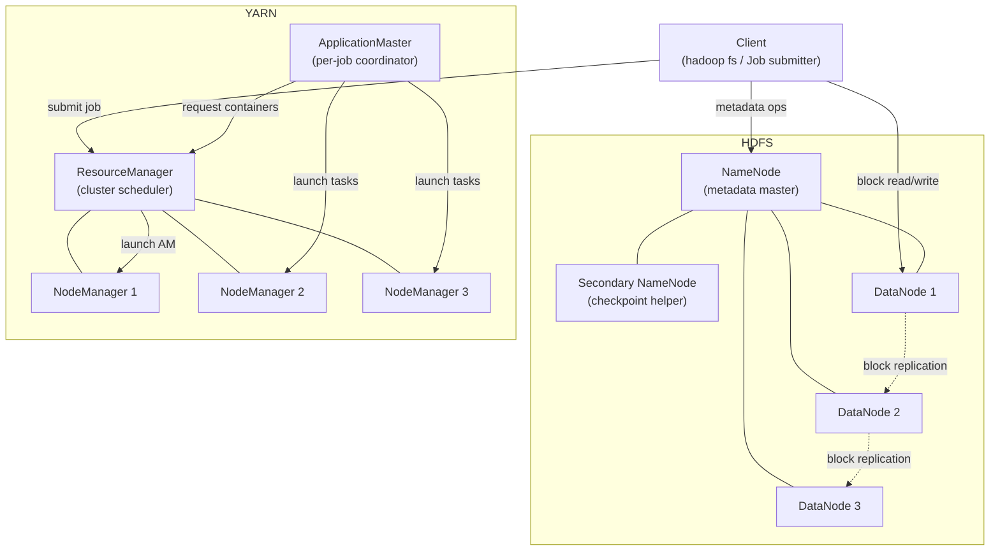

Hadoop's architecture follows a master/worker pattern across all of its subsystems. A small number of master daemons coordinate metadata and resource allocation, while a large number of worker daemons running on every data node handle the actual storage and computation. This separation means the cluster can scale horizontally — adding capacity is as straightforward as commissioning new nodes and registering them with the masters. The two main subsystems, HDFS and YARN, are independent but designed to run on the same physical cluster so that computation can be moved to the data rather than moving large volumes of data across the network.

## High-level component map

<Tabs>
  <Tab title="HDFS architecture">

    ## HDFS: distributed file system

    HDFS stores files by splitting them into large fixed-size blocks (128 MB by default) and distributing those blocks across DataNodes in the cluster. Each block is independently replicated — three copies by default — across different DataNodes, and where possible, different server racks. This means the cluster can lose a DataNode (or a whole rack in a rack-aware deployment) with no data loss and no manual intervention.

    ### NameNode

    The NameNode is the metadata master for the entire file system. It stores the namespace tree — every directory, file name, permission, and the mapping from file to block IDs — entirely in memory for fast access. It does **not** store file data; it only knows where each block lives.

    The NameNode persists its state to disk in two structures:

    - **FSImage** — a periodic full snapshot of the namespace, written by the Secondary NameNode during checkpointing.
    - **EditLog** — a write-ahead log of every namespace mutation since the last checkpoint. At startup the NameNode replays the EditLog on top of the FSImage to reconstruct current state.

    <Warning>
      The NameNode is a single point of failure in a non-HA deployment. For production clusters, configure NameNode High Availability with two or more NameNode daemons and a quorum journal to eliminate this risk. See [Cluster Setup](/installation/cluster-setup).
    </Warning>

    ### Secondary NameNode

    Despite the name, the Secondary NameNode is not a hot standby. Its role is periodic checkpointing: it downloads the current FSImage and EditLog from the active NameNode, merges them into a new FSImage, and uploads the result back. This keeps the EditLog from growing unboundedly and reduces NameNode startup time after a restart.

    <Note>
      In NameNode HA configurations the Secondary NameNode is replaced by a Standby NameNode, which performs checkpointing automatically and can be promoted to active if the primary fails.
    </Note>

    ### DataNodes

    DataNodes store block data on local disks and serve read/write requests directly from clients. They send periodic **block reports** to the NameNode (listing all blocks they hold) and continuous **heartbeats** (every 3 seconds by default) to signal they are alive. If the NameNode stops receiving heartbeats from a DataNode, it marks that node dead and instructs surviving DataNodes to replicate the affected blocks to restore the configured replication factor.

    ### Data write path

    When a client writes a file:

    1. The client contacts the NameNode to create the file entry and obtain a list of DataNodes to use for the first block.
    2. The client streams data directly to the first DataNode in the **pipeline**.
    3. That DataNode forwards the data to the second, which forwards it to the third, forming a replication pipeline.
    4. Acknowledgements flow back up the pipeline to the client.
    5. When the block is full, the client requests DataNodes for the next block and repeats.
    6. On close, the client notifies the NameNode that the file is complete.

    ### Data read path

    When a client reads a file:

    1. The client queries the NameNode for the block locations.
    2. The NameNode returns a list of DataNodes holding each block, ordered by network proximity to the client.
    3. The client reads each block directly from the closest DataNode, bypassing the NameNode entirely.

    <Tip>
      Reading locally from the closest DataNode is why co-locating compute and storage on the same physical nodes improves performance significantly. YARN is aware of data locality and prefers to schedule tasks on or near the nodes that hold the relevant HDFS blocks.
    </Tip>

    ### Block replication and rack awareness

    The default block placement policy places:

    - The first replica on the writer's node (or a random DataNode if the client is off-cluster).
    - The second replica on a DataNode in a **different rack**.
    - The third replica on a different DataNode in that second rack.

    This means any single rack failure can only affect one of the three replicas, preserving data availability.

  </Tab>
  <Tab title="YARN architecture">

    ## YARN: resource management

    YARN (Yet Another Resource Negotiator) decouples resource management from application logic. Before YARN, MapReduce controlled both job scheduling and cluster resources, which prevented other processing frameworks from running on the same cluster. YARN introduces a generic resource layer so that MapReduce, Apache Spark, Apache Tez, and other frameworks can share the same hardware managed by a single scheduler.

    ### ResourceManager

    The ResourceManager is the cluster-wide master for resource allocation. It has two main components:

    - **Scheduler** — a pluggable policy engine that decides which applications get resources. The two built-in schedulers are the Capacity Scheduler (divides the cluster into queues with guaranteed minimums and elastic sharing) and the Fair Scheduler (dynamically balances resources across all running applications).
    - **ApplicationsManager** — accepts job submissions, negotiates a container for each job's ApplicationMaster, and monitors ApplicationMaster liveness, restarting it on failure.

    ### NodeManagers

    A NodeManager daemon runs on every worker node. It is responsible for:

    - Launching and monitoring **containers** — isolated processes with allocated CPU and memory limits.
    - Reporting node health and available resources to the ResourceManager at regular intervals.
    - Cleaning up container resources (temporary files, cgroup allocations) after a container exits.

    ### ApplicationMaster

    Each application submitted to YARN gets its own ApplicationMaster process, launched in a container on one of the worker nodes. The ApplicationMaster is framework-specific — the MapReduce ApplicationMaster (`MRAppMaster`) understands how to split input, assign map and reduce tasks, handle task failures, and report progress to the client.

    The lifecycle of a YARN application is:

    1. **Submit** — the client submits an application to the ResourceManager.
    2. **Launch AM** — the ResourceManager allocates a container and starts the ApplicationMaster.
    3. **Request resources** — the ApplicationMaster registers with the ResourceManager and requests containers for its tasks.
    4. **Schedule** — the Scheduler grants containers on NodeManagers that have available capacity, preferring nodes with data locality.
    5. **Execute** — the ApplicationMaster instructs the NodeManagers to launch task containers.
    6. **Complete** — the ApplicationMaster reports success or failure to the ResourceManager and exits.

    ### Resource model

    YARN allocates resources in terms of **containers** — each container is a tuple of `(vcores, memory)`. The ResourceManager never allocates fractional containers; the minimum and maximum container sizes are configured cluster-wide. By default, the minimum container is 1 vcore and 1 GB of memory.

    <Note>
      YARN supports **resource profiles** and **custom resources** (GPUs, FPGAs) for heterogeneous clusters. See the YARN documentation for details.
    </Note>

    ### How YARN schedules MapReduce jobs

    When a MapReduce job is submitted:

    1. The client uploads the job JAR and configuration to HDFS.
    2. The client calls `ResourceManager.submitApplication()`.
    3. The ResourceManager launches the `MRAppMaster` in a container.
    4. The `MRAppMaster` reads the job configuration and input splits from HDFS.
    5. It requests one container per map task (and later per reduce task) from the ResourceManager.
    6. The Scheduler grants containers, prioritizing nodes where the input split's HDFS block is locally stored.
    7. The `MRAppMaster` tells each NodeManager to launch a `YarnChild` JVM that runs the map or reduce task.
    8. Tasks report progress back to the `MRAppMaster`, which surfaces aggregate progress to the client.
    9. On completion, the `MRAppMaster` writes job counters and history to HDFS and exits.

  </Tab>
</Tabs>

## Component interaction summary

<AccordionGroup>
  <Accordion title="How HDFS and YARN share the same cluster">
    HDFS DataNodes and YARN NodeManagers are typically co-located on the same physical machines. This co-location is deliberate: the YARN Scheduler uses **data locality** information from the NameNode to prefer scheduling map tasks on the NodeManager that is running on the same host as the HDFS DataNode holding the relevant input block. This minimizes network traffic during the map phase — data is read from local disk rather than over the network.

    The two subsystems are otherwise independent. Each has its own master (NameNode vs. ResourceManager) and its own worker daemons (DataNode vs. NodeManager). A failure in YARN does not affect HDFS availability, and vice versa.
  </Accordion>
  <Accordion title="The hadoop-common layer">
    All Hadoop subsystems share common libraries provided by the `hadoop-common` module. Key components include:

    - **`FileSystem` API** — an abstract base class (`org.apache.hadoop.fs.FileSystem`) that provides a uniform interface for file operations across HDFS, local disk, S3, Azure ADLS, and other backends. Application code written against `FileSystem` works with any supported storage backend without changes.
    - **`Configuration`** — a key-value store that resolves settings from XML files (`core-site.xml`, `hdfs-site.xml`, `yarn-site.xml`, `mapred-site.xml`), environment variables, and programmatic overrides.
    - **IPC / RPC framework** — a Protobuf-based RPC system used by all inter-daemon communication: client-to-NameNode, DataNode-to-NameNode, ApplicationMaster-to-ResourceManager, and so on.
    - **Security** — Kerberos-based authentication via `UserGroupInformation`, delegation tokens for job-to-service authentication without continuous Kerberos traffic, and ACL-based authorization.
  </Accordion>
  <Accordion title="Network topology and rack awareness">
    Hadoop is designed to run on clusters where intra-rack bandwidth is significantly higher than inter-rack bandwidth. Both HDFS and YARN accept a `topology.script.file.name` configuration that maps node IP addresses to rack identifiers. HDFS uses this topology to make informed block placement decisions (first and second replica on different racks), and YARN uses it to express locality preferences as rack-local when node-local scheduling is not possible.
  </Accordion>
</AccordionGroup>

## Further reading

<CardGroup cols={2}>
  <Card title="HDFS" icon="database" href="/hdfs/overview">
    Deep dive into HDFS configuration, erasure coding, snapshots, and the `hadoop fs` command reference.
  </Card>
  <Card title="YARN" icon="layer-group" href="/yarn/overview">
    Capacity Scheduler configuration, queue hierarchies, node labels, and application priority.
  </Card>
  <Card title="MapReduce" icon="shuffle" href="/mapreduce/overview">
    Writing Map and Reduce functions, input formats, output formats, and job configuration.
  </Card>
  <Card title="Cluster setup" icon="network-wired" href="/installation/cluster-setup">
    Provision a multi-node cluster with NameNode HA, YARN, and rack-aware block placement.
  </Card>
</CardGroup>
