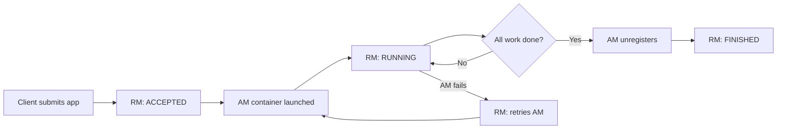

YARN models cluster capacity as a collection of containers, where each container represents a bounded allocation of memory (in MB) and virtual CPU cores (vCores) on a specific node. Applications request containers of a particular size; the scheduler decides when and where to grant them based on available capacity and the active scheduling policy. This page covers the resource model, the three built-in scheduling algorithms, NodeManager configuration, the full application lifecycle, queue-based allocation, preemption, and the key `yarn-site.xml` properties that govern all of it.

## Resource model

The two primary resource dimensions are:

- **Memory (`yarn.nodemanager.resource.memory-mb`)** — total memory in MB that a NodeManager makes available to containers. The default is 8192 MB. Set this below total physical RAM to leave headroom for the OS and NodeManager process itself.
- **vCores (`yarn.nodemanager.resource.cpu-vcores`)** — virtual CPU cores available for container scheduling. The default is 8. This is a logical unit; YARN does not enforce CPU limits via OS cgroups unless `yarn.nodemanager.linux-container-executor.cgroups.strict-resource-usage` is enabled.

Custom resource types (GPUs, FPGAs, network bandwidth) can be registered in `resource-types.xml`. Once defined, they can be requested by applications and enforced by the NodeManager.

```xml yarn-site.xml — NodeManager resource limits
<configuration>
  <property>
    <name>yarn.nodemanager.resource.memory-mb</name>
    <value>49152</value>
    <description>48 GB available for containers on this node</description>
  </property>
  <property>
    <name>yarn.nodemanager.resource.cpu-vcores</name>
    <value>16</value>
  </property>
</configuration>
```

<Tip>
  Leave at least 10–15% of node memory outside YARN's control for the operating system, HDFS DataNode, and the NodeManager daemon itself.
</Tip>

## Scheduling algorithms

YARN ships with three scheduler implementations. You select one by setting `yarn.resourcemanager.scheduler.class` in `yarn-site.xml`.

<Tabs>
  <Tab title="FIFO">
    The simplest scheduler. Applications are served in submission order; the first application gets as many resources as it needs before the next one starts. Suitable only for single-tenant development clusters where fairness across concurrent jobs is not a concern.

    ```xml yarn-site.xml
    <property>
      <name>yarn.resourcemanager.scheduler.class</name>
      <value>org.apache.hadoop.yarn.server.resourcemanager.scheduler.fifo.FifoScheduler</value>
    </property>
    ```
  </Tab>
  <Tab title="Capacity Scheduler">
    The default scheduler for multi-tenant deployments. Partitions the cluster into a hierarchy of queues, each with a guaranteed capacity percentage. Teams or workloads are assigned to queues; unused capacity can be borrowed by other queues up to a configurable maximum. See [Capacity Scheduler](/yarn/capacity-scheduler) for full configuration details.

    ```xml yarn-site.xml
    <property>
      <name>yarn.resourcemanager.scheduler.class</name>
      <value>org.apache.hadoop.yarn.server.resourcemanager.scheduler.capacity.CapacityScheduler</value>
    </property>
    ```
  </Tab>
  <Tab title="Fair Scheduler">
    Dynamically balances resources across all running applications so that each gets an equal share of the cluster over time. Supports weighted pools and minimum share guarantees. See [Fair Scheduler](/yarn/fair-scheduler) for full configuration details.

    ```xml yarn-site.xml
    <property>
      <name>yarn.resourcemanager.scheduler.class</name>
      <value>org.apache.hadoop.yarn.server.resourcemanager.scheduler.fair.FairScheduler</value>
    </property>
    ```
  </Tab>
</Tabs>

## Container resource requests

An application's ApplicationMaster submits `ResourceRequest` objects that specify the desired memory and vCores for each container, along with a locality preference (node, rack, or any). The scheduler matches these against available capacity on NodeManagers.

```java
// Minimum and maximum container sizes are enforced by the cluster
// Default minimum: 1024 MB, 1 vCore
// Default maximum: 8192 MB, 4 vCores (yarn.scheduler.maximum-allocation-*)

ResourceRequest request = ResourceRequest.newInstance(
    Priority.newInstance(0),
    ResourceRequest.ANY,           // no locality preference
    Resource.newInstance(2048, 1), // 2 GB, 1 vCore
    3                              // number of containers
);
```

<Warning>
  Container requests smaller than `yarn.scheduler.minimum-allocation-mb` or `yarn.scheduler.minimum-allocation-vcores` are rounded up to the minimum. Requests larger than the maximum are rejected.
</Warning>

## Application lifecycle



The `YarnApplicationState` enum records the states an application passes through:

| State | Meaning |
|---|---|
| `NEW` | Application created, not yet submitted |
| `ACCEPTED` | RM has accepted the submission |
| `RUNNING` | ApplicationMaster is alive and managing containers |
| `FINISHED` | Application completed successfully |
| `FAILED` | Application exited with an error |
| `KILLED` | Application was stopped by an operator or timeout |

## Queues and resource allocation

Both the Capacity and Fair schedulers organize workloads into queues (also called pools). Applications are submitted to a named queue; the scheduler tracks per-queue resource consumption and enforces limits.

<AccordionGroup>
  <Accordion title="Submitting an application to a specific queue">
    Set the queue name in the `ApplicationSubmissionContext` before calling `submitApplication`:

    ```java
    ApplicationSubmissionContext ctx = app.getApplicationSubmissionContext();
    ctx.setQueue("engineering");
    yarnClient.submitApplication(ctx);
    ```

    From the command line with `yarn jar`:

    ```bash
    yarn jar myapp.jar MyMain \
      -Dmapreduce.job.queuename=engineering \
      input output
    ```
  </Accordion>
  <Accordion title="Checking queue state via the REST API">
    The ResourceManager exposes queue metrics at its REST endpoint:

    ```bash
    curl http://resourcemanager-host:8088/ws/v1/cluster/scheduler
    ```

    The response includes `capacity`, `usedCapacity`, `maxCapacity`, and active application counts per queue.
  </Accordion>
</AccordionGroup>

## Preemption

Preemption allows the scheduler to reclaim resources from queues that are consuming more than their fair share, and redirect them to queues that are starved. The RM sends a `PreemptionMessage` to the relevant ApplicationMaster, giving it a grace period to voluntarily release containers before the RM forcibly kills them.

```xml yarn-site.xml — enable preemption
<configuration>
  <property>
    <name>yarn.resourcemanager.monitor.capacity.preemption.enabled</name>
    <value>true</value>
  </property>
  <property>
    <name>yarn.resourcemanager.monitor.capacity.preemption.monitoring_interval</name>
    <value>3000</value>
    <description>How often (ms) to check for preemption candidates</description>
  </property>
  <property>
    <name>yarn.resourcemanager.monitor.capacity.preemption.max_wait_before_kill</name>
    <value>15000</value>
    <description>Grace period (ms) before forcible container kill</description>
  </property>
</configuration>
```

<Note>
  Preemption interrupts running containers, which can cause application retries and increased overall runtime. Enable it only when queue SLA enforcement is more important than individual job throughput.
</Note>

## Web UI walkthrough

The ResourceManager web UI at `http://resourcemanager-host:8088` has three primary views:

| View | Path | What it shows |
|---|---|---|
| Applications | `/cluster/apps` | All applications with state, queue, user, progress, and elapsed time |
| Nodes | `/cluster/nodes` | Each NodeManager's address, state, total and available resources |
| Scheduler | `/cluster/scheduler` | Queue tree with capacity, used capacity, and active apps per queue |

## Key yarn-site.xml properties

```xml yarn-site.xml — common resource management settings
<configuration>
  <!-- Scheduler selection -->
  <property>
    <name>yarn.resourcemanager.scheduler.class</name>
    <value>org.apache.hadoop.yarn.server.resourcemanager.scheduler.capacity.CapacityScheduler</value>
  </property>

  <!-- Global container size bounds -->
  <property>
    <name>yarn.scheduler.minimum-allocation-mb</name>
    <value>1024</value>
  </property>
  <property>
    <name>yarn.scheduler.maximum-allocation-mb</name>
    <value>8192</value>
  </property>
  <property>
    <name>yarn.scheduler.minimum-allocation-vcores</name>
    <value>1</value>
  </property>
  <property>
    <name>yarn.scheduler.maximum-allocation-vcores</name>
    <value>4</value>
  </property>

  <!-- NodeManager resources -->
  <property>
    <name>yarn.nodemanager.resource.memory-mb</name>
    <value>8192</value>
  </property>
  <property>
    <name>yarn.nodemanager.resource.cpu-vcores</name>
    <value>8</value>
  </property>

  <!-- ResourceManager address -->
  <property>
    <name>yarn.resourcemanager.hostname</name>
    <value>rm1.example.com</value>
  </property>
</configuration>
```
